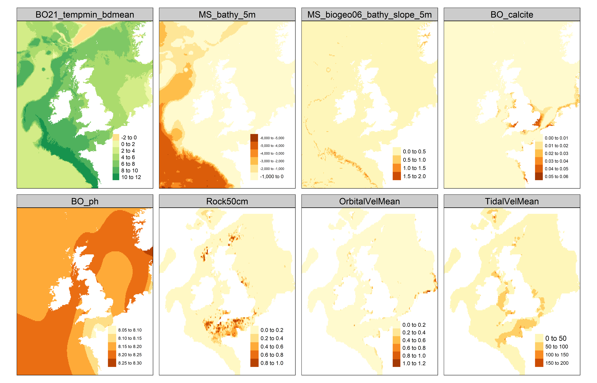
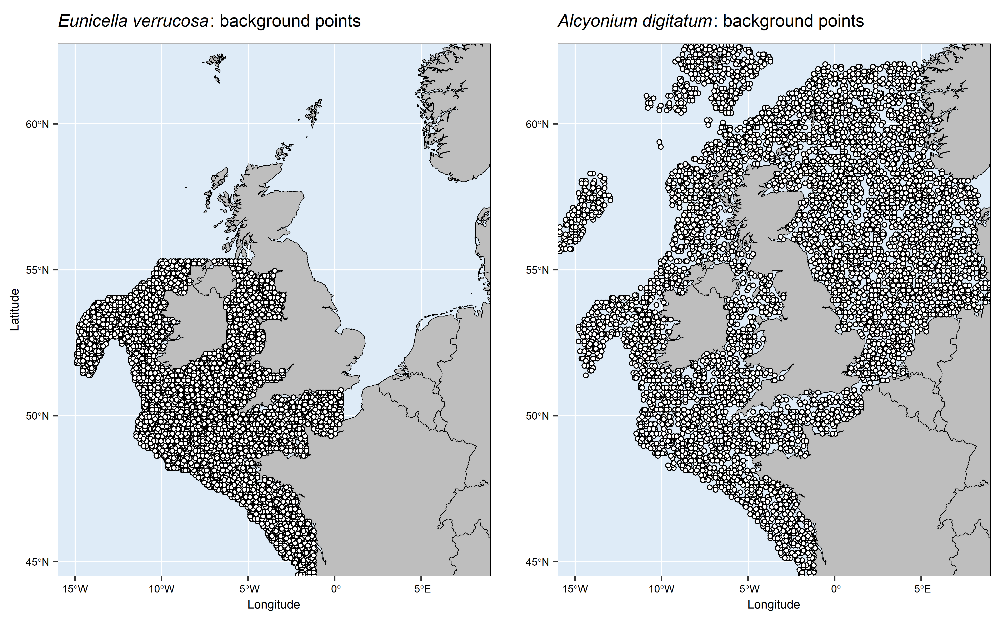
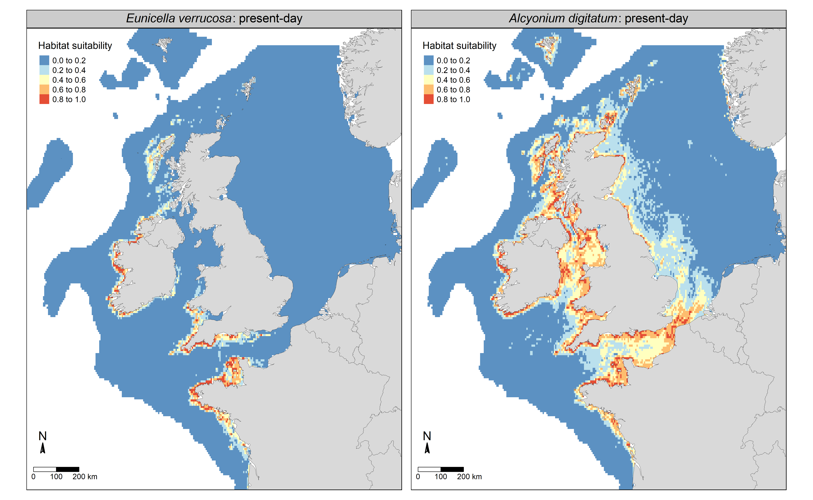
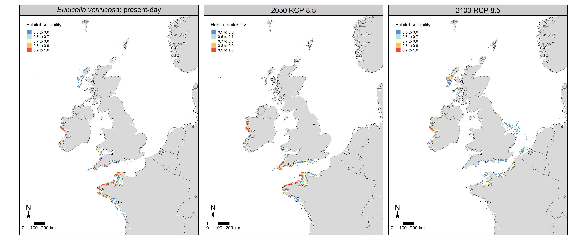

  
```{r setup, include=FALSE}
knitr::opts_chunk$set(echo = TRUE)
```
<div id="contents"/>


<!-- # Figure S1 -->
## Figure S1
```{r, include=TRUE, fig.align="center", echo=FALSE, out.width = "100%"}

```
\textbf{Figure S1.} Thematic map of each raster predictor variable used in the species distribution models. BO21_tempmin_bdmin = minimum sea bottom temperature; MS_bathy_5m = bathymetry; MS_biogeo06_bathy_slope_5m = slope; BO_calcite = calcite concentration at sea surface; BO_ph = pH at sea surface; Rock50cm = proportion of rock cover; OrbitalVelMean = wave orbital velocity; TidalVelMean = tidal velocity. 

\newpage

<!-- # Figure S2 -->
## Figure S2
```{r, include=TRUE, fig.align="center", echo=FALSE, out.width = "100%"}

```
\textbf{Figure S2.} Map of the background points used in the Maxent species distribution models for the pink sea fan (\textit{Eunicella verrucosa}) and dead man's fingers (\textit{Alcyonium digitatum}).

\newpage

<!-- # Figure S3 -->
## Figure S3  
```{r, include=TRUE, fig.align="center", echo=FALSE, out.width = "100%"}

```
\textbf{Figure S3.} Present-day maps of habitat suitability for the pink sea fan (\textit{Eunicella verrucosa}) and dead man's fingers (\textit{Alcyonium digitatum}) based on Maxent species distribution models. Probability of presence is interpreted as a proxy for habitat suitability; all probabilities from the models are shown.

\newpage

<!-- # Figure S4 -->
## Figure S4 
```{r, include=TRUE, fig.align="center", echo=FALSE, out.width = "100%"}

```
\textbf{Figure S4.} Future predictions of habitat suitability for the pink sea fan (\textit{Eunicella verrucosa}) based on a Maxent species distribution model. Future layers of sea bottom temperature were substituted for the present-day layer while all other layers used to originally train the model were kept; the model was then re-run to generate future predictions. Predictions for Representative Concentration Pathway (RCP) 8.5 are shown for 2050 and 2100. Probability of presence is interpreted as a proxy for habitat suitability; only probabilities greater than 0.5 are shown.

[\textcolor{blue}{Back to Contents}](#contents)
