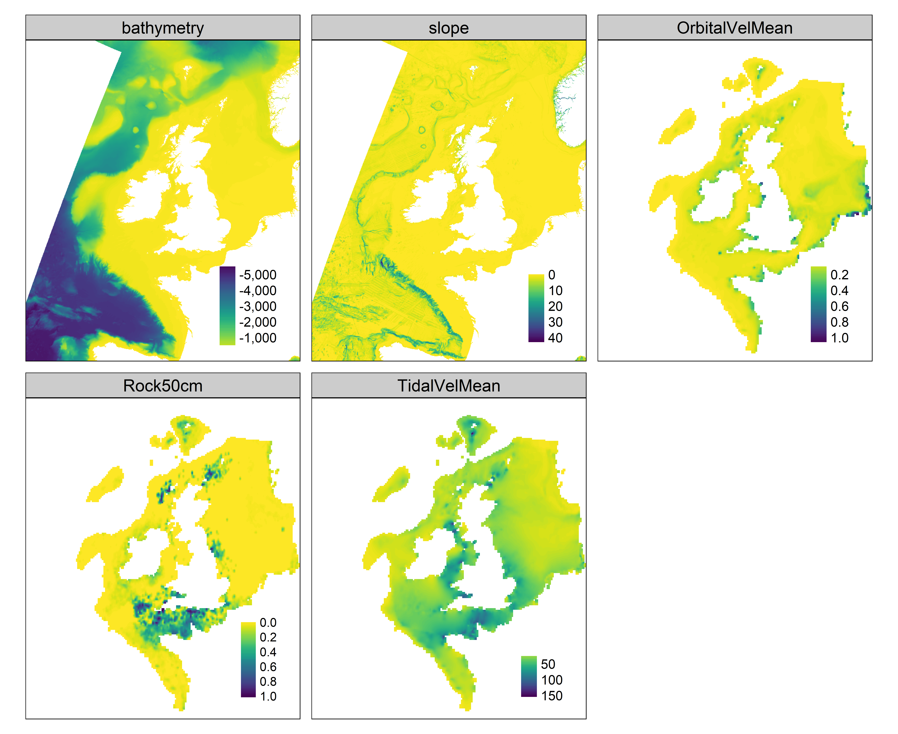

  
```{r setup, include=FALSE}
knitr::opts_chunk$set(echo = TRUE)
```
<div id="contents"/>


<!-- # Figure S1 -->
## Figure S1
```{r, include=TRUE, fig.align="left", echo=FALSE, out.width = "100%"}

```
\textbf{Figure S1.} Thematic map of each raster predictor variable used in the species distribution models.
```{r, include=TRUE, fig.align="left", echo=FALSE, out.width = "100%"}
knitr::include_graphics("../figures/FigureS1Bi.png")
```
\textbf{Figure S1.} Thematic map of each raster predictor variable used in the species distribution models.
```{r, include=TRUE, fig.align="left", echo=FALSE, out.width = "100%"}
knitr::include_graphics("../figures/FigureS1Bii.png")
```
\textbf{Figure S1.} Thematic map of each raster predictor variable used in the species distribution models.

<!-- # Figure S2 -->
## Figure S2
```{r, include=TRUE, fig.align="left", echo=FALSE, fig.show="hold", out.width="45%", out.height="80%"}
knitr::include_graphics(c("../figures/gt_psf.png", "../figures/gt_dmf.png"))
```
\textbf{Figure S2.} Results of model evaluation for the pink sea fan (\textit{Eunicella verrucosa}) and dead man's fingers (\textit{Alcyonium digitatum}).
